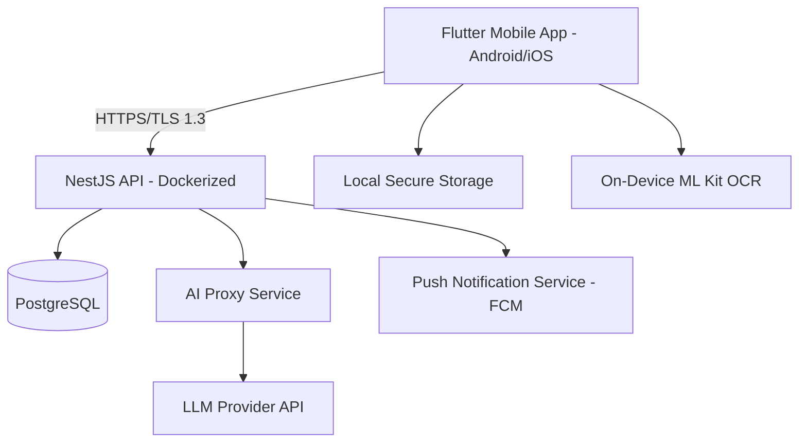
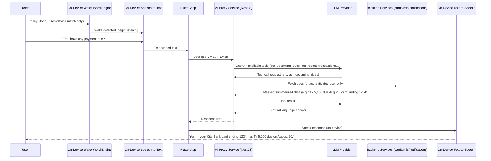
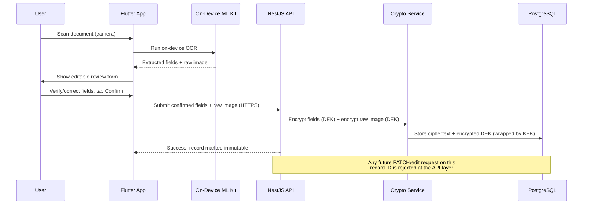

# MyPocket — Architecture

**Version:** 2.0 (Full Rebuild)
**Status:** Approved for implementation
**Last Updated:** 2026-08-05

---

## 1. System Overview

MyPocket is a cross-platform (Android + iOS) digital wallet for Bangladesh, storing bank cards, mobile financial service (MFS) account references, government ID documents (NID/Passport), certificates, and transit passes — with an integrated AI assistant. The application handles highly sensitive personal data (government ID numbers, financial card data) and is architected security-first.



---

## 2. Technology Stack

| Layer | Technology | Rationale |
|---|---|---|
| Mobile | Flutter (Dart) | Single codebase, Android + iOS, mature biometric/secure-storage packages |
| State Management | **Riverpod** | Testability, compile-time safety, less boilerplate than Bloc, avoids GetX's service-locator anti-pattern |
| Backend | NestJS (Node.js/TypeScript) | Modular, DI-based, maps cleanly to SOLID/clean architecture |
| Database | PostgreSQL | Relational integrity for financial/identity data, mature encryption tooling |
| ORM | **Prisma** | Type-safe, strong migration tooling, clean schema for reasoning about encrypted fields |
| Containerization | Docker + Docker Compose | Local dev now, portable to cloud (Oracle Cloud Always-Free) at launch |
| OCR | Google ML Kit (on-device) | Free, offline-capable, no data leaves device during scan |
| AI Assistant | Backend-proxied LLM | API key never shipped client-side; enables rate limiting/cost control |
| Push Notifications | Firebase Cloud Messaging | Retained for delivery only — no sensitive data ever passes through FCM payloads |
| Auth | JWT (access + refresh) + biometric device gate | Industry standard token auth layered with device-level biometric lock |

---

## 3. Module Architecture (Backend)

One NestJS module per domain, each with its own controller/service/repository layers. No module accesses another module's database tables directly — cross-module interaction goes through injected services only.

```
src/
├── auth/            # Registration, login, JWT issuance/refresh, password hashing
├── users/            # User profile, preferences, language setting
├── crypto/          # Envelope encryption service (KEK/DEK), shared by all sensitive-data modules
├── cards/            # Bank card storage (tokenized, immutable-after-confirm)
├── mfs/              # MFS account references + MfsProvider adapter interface
├── documents/        # NID/Passport vault (structured fields + encrypted raw scans)
├── certificates/      # Certificate categories and encrypted file storage
├── transit/          # Transit card management + QR boarding simulation
├── notifications/    # Expiry reminders, proactive nudges, FCM dispatch
├── ai/                # AI proxy service (OCR-assist + conversational assistant)
└── common/           # Guards, interceptors, validation pipes, shared DTOs
```

### Mobile App Structure (Flutter)

Clean architecture per feature:

```
lib/
├── core/              # Theme, constants, localization, network client, secure storage wrapper
├── features/
│   ├── auth/
│   │   ├── data/            # API calls, local token storage
│   │   ├── domain/          # Entities, use cases
│   │   └── presentation/    # Screens, widgets, state
│   ├── cards/          (same 3-layer structure)
│   ├── mfs/
│   ├── documents/       # ID vault
│   ├── certificates/
│   ├── transit/
│   └── assistant/        # Floating bubble, chat UI, mascot animations
└── main.dart
```

---

## 4a. Data Flow: "Moon" Assistant — Tool-Calling & Voice



**Key security properties:**
- The LLM never receives raw sensitive fields (full card numbers, NID/Passport numbers) — only masked summaries assembled by the backend before the tool result is returned.
- Tool calls are always scoped to the authenticated user's own JWT session; the LLM cannot specify or influence which user's data is fetched.
- Wake-word detection is 100% on-device; no audio is transmitted until a query begins after the wake word fires.
- Voice transcription uses the OS's native speech recognition (Android `SpeechRecognizer` / iOS `Speech` framework) — depending on OS-level settings, native STT may itself use the OS vendor's cloud transcription service; this is a platform-level behavior outside MyPocket's own data flow, not MyPocket servers receiving raw audio.

---

## 4b. Data Flow: Smart Sync (Android-only Notification Parsing)

```mermaid
sequenceDiagram
    participant Bank as Bank/MFS App
    participant OS as Android Notification System
    participant Listener as MyPocket NotificationListenerService
    participant Parser as On-Device Parsing Engine
    participant App as Flutter App
    participant API as NestJS API

    Bank->>OS: Posts notification (e.g. "Tk 500 debited...")
    OS->>Listener: Notification event
    Listener->>Listener: Check sender package against per-account allowlist
    alt Package not in allowlist
        Listener->>Listener: Ignore, discard immediately
    else Package matches linked card/MFS account
        Listener->>Parser: Pass notification text (in-memory only)
        Parser->>Parser: Apply provider-specific template, extract amount/date/reference/type
        Parser-->>Listener: Structured record; raw text discarded
        Listener->>App: Structured transaction/notice object
        App->>API: Submit structured record (HTTPS, encrypted at rest server-side)
    end
```

**Key security properties:**
- The listener only activates for accounts the user explicitly opted into ("Enable Smart Sync for this account?"), and only after the corresponding card/MFS account has been added and confirmed.
- Package-name allowlisting means notifications from unrelated apps are never inspected or passed to the parser.
- Raw notification text never leaves the device and is never written to disk — it exists only transiently in memory during parsing.
- iOS has no equivalent capability (platform restriction); manual entry is the parity path.

---

## 4c. Data Flow: Sensitive Document Capture (NID/Passport/Cards)

This is the highest-risk flow in the app and is documented in detail.



**Key security properties:**
- Raw image and structured fields are encrypted **separately**, each with the record's DEK.
- The DEK itself is encrypted by a server-held KEK (envelope encryption) — compromising the database alone does not expose plaintext data.
- Immutability is enforced at the API layer (a `confirmed_at` timestamp on the record blocks all edit endpoints), not just hidden in the UI.
- Viewing a confirmed record's raw scan or full field data requires a **fresh biometric/PIN check**, even within an already-unlocked session.

---

## 5. Threat Model (Summary)

| Threat | Mitigation |
|---|---|
| Device theft/loss | Biometric app lock; secure hardware-backed local token storage; remote data lives encrypted server-side, not fully cached locally |
| Database breach | Envelope encryption — ciphertext + wrapped keys only; plaintext never touches disk |
| Man-in-the-middle | TLS 1.3 enforced on all API traffic; certificate pinning considered for release build |
| CVV/full card number leakage | CVV never persisted anywhere; card numbers tokenized, only last 4 digits stored in plaintext for display |
| Unauthorized ID document sharing | Print/Share gated by re-authentication + explicit confirmation dialog every time |
| QR-based data leakage | No QR ever encodes raw personal data directly — sharing tokens are time-limited and revocable |
| Fake/forged document misuse | Print template uses raw scan only for personal reference use; app does not claim official document status; in-app legal disclosure present |
| AI prompt injection / data exfiltration via assistant | AI proxy service does not have direct DB query access; only receives data explicitly passed by the mobile app per-request; all AI calls logged (metadata only, not full PII payloads) |
| Abuse of AI endpoints (cost) | Rate limiting per user on `/ai/*` endpoints |
| Replay/token theft | Short-lived access tokens + refresh token rotation |
| Notification Listener over-reach / scope creep | Allowlist enforced per-linked-account only; feature is opt-in per account, never a blanket "read all notifications" grant |
| Notification content leakage | Raw notification text never persisted or transmitted — parsed in-memory, only structured fields (amount/date/reference) leave the device |
| Google Play policy rejection (notification/SMS access) | Deliberately avoided `READ_SMS`; `NotificationListenerService` usage scoped and documented for Data Safety disclosure |
| Bank/MFS notification format changes breaking parsing | Per-provider template rules isolated and versioned; silent parse failures logged (metadata only) for maintenance, not surfaced as false transaction data |
| Background microphone privacy risk (Android wake-word) | Opt-in, default OFF; persistent notification discloses active listening (OS-required); wake-word matching is on-device only, no raw audio leaves the device until a query begins |
| Battery/resource abuse from always-on listening | Lightweight wake-word engine (~1–3% idle CPU class); auto-suspends on low battery or Battery Saver mode |
| Google Play rejection of background mic feature | Implemented behind a remote feature flag — can be disabled server-side without requiring an app resubmission |
| LLM provider receiving sensitive data via assistant queries | Backend assembles only masked/summarized data before it ever reaches the LLM; full card numbers and NID/Passport numbers are never included in any prompt or tool result |
| Tool-calling abuse (LLM fetching another user's data) | Tool execution is bound to the authenticated session's user ID server-side; the LLM has no ability to specify or override which user's data is queried |

---

## 6. Deployment Plan

- **Development:** Docker Compose (API + PostgreSQL) running locally, Flutter app pointed at local network IP or `ngrok` tunnel for device testing.
- **Production launch:** Oracle Cloud Always-Free tier (ARM VM), same Docker Compose setup, fronted by a reverse proxy (Caddy or Nginx) with automatic HTTPS.
- **Database backups:** Scheduled encrypted backups (backup files are already ciphertext at the field level, but transport/storage of backups still follows least-privilege access).
- **CI/CD:** Deferred until Milestone 9 — manual deploy acceptable pre-launch, automated pipeline recommended before public release scale-up.

---

## 7. Open Items

These require your decision before or during implementation (mirrored in `IMPLEMENTATION_STATUS.md`):
1. ~~State management: Riverpod vs Bloc~~ — **Resolved: Riverpod**
2. ~~ORM: Prisma vs TypeORM~~ — **Resolved: Prisma**
3. Certificate pinning: include in v1 release build or defer
4. CI/CD tooling choice (GitHub Actions recommended given GitHub is already in use)
